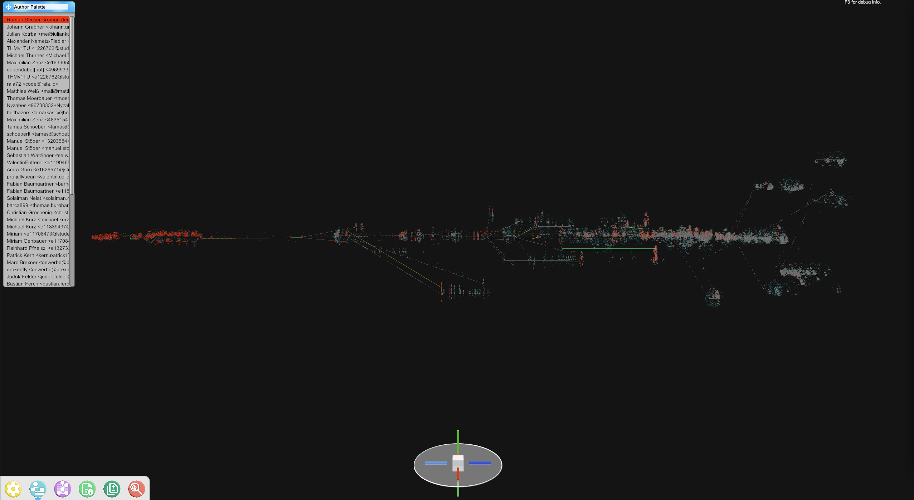
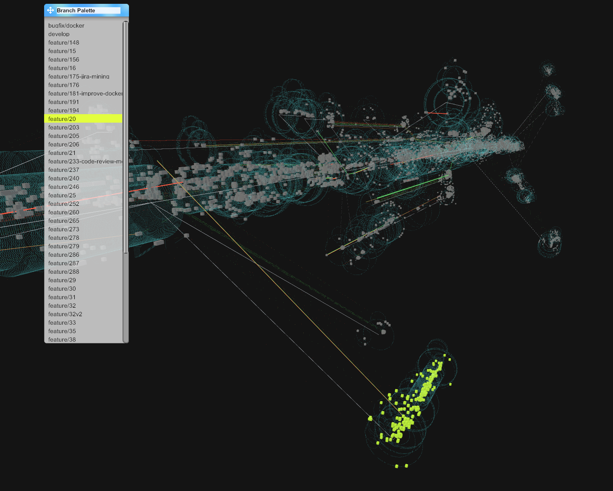

<h1 align="center">Holocular</h1>

## Concept
Holocular is a 3D interactive version control visualization that enables its user a deeper
understanding of a version-controlled repository.
It herby combines the graphical capabilities of the Unity Game Engine with comprehensive version
 control analytics.

## Usage
The latest official release of Holocular can be found in the [Github Release Section](https://github.com/INSO-World/Holocular/releases/latest).

As the focus of the Holocular project is mainly based on the visualization and interaction the mining
of the repository is outsourced to the [Binocular](https://github.com/INSO-World/Binocular/tree/develop)
project.
To visualize a repository with Holocular, you first need to check out Binocular, run binocular on
the desired repository and export its database.
That Database Export can now be imported into Holocular.

## Screenshots

https://github.com/user-attachments/assets/090a8ae8-e284-4f35-9aaf-c8844f237cb4

Here a small demonstration is shown of how Holocular is used to analyze the Binocular repository.

### Authors over Time

The full history of the analyzed project is spread out over a timescale with color-coded authors.

### Ownership over Time

The full history of the analyzed project is spread out over a timescale with the ownership
of one author highlighted.

### Filter Author

One author is selected in the author palette and highlighted in the visualization.

### Filter Branch

One branch is selected in the author palette and highlighted in the visualization.

### Hotspots

The hotspot mode shows files that got edited a lot.

### Settings

The settings panel lets the user import a Binocular database export, change what is visualized
and how the visualization behaves.

### Dock

The dock shows the user which windows are currently open and closed and lets the user open
and close them. From left to right the windows are: Settings, Author Palette, Branch Palette,
File Info, File Compare, Debug View

### File Info

When selecting a file, the File Info window opens where informations about the file at the
specific moment in the commit history can be found

### Code Changes

By pressing the Compare With Parent Button in the File Info window, it is also possible to open
a compare view between the selected version of a file and its parents.
Here the precise changes can be seen that happened to the file in the selected Commit
if available.

### Interactive Compass

For easier navigation, an interactive compass exists in the bottom center of the screen.
By clicking one of the axes, the view will rotate in the desired direction, and by pressing the 
 center, the view will zoom out to show the full tree.

### Author and Branch Palette

The author and branch palettes show which authors and branches correlate to which colors.

### Debug Panel

The debug panel offers the developers deeper insights into the behavior of Holocular.

## Contributing
To edisdwt Holocular currently Unity3D Version: 2021.3.16f1 LTS is required.
